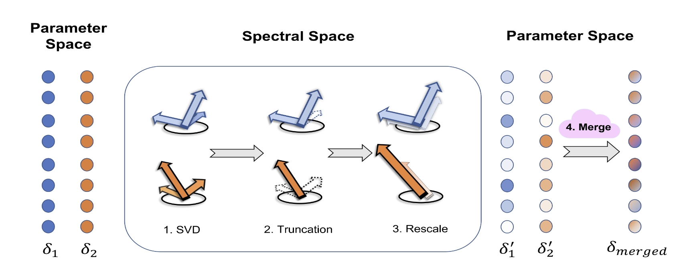

# STAR: Spectral Truncation and Rescale for Model Merging ([NAACL 2025](https://2025.naacl.org/))



## Setup
```bash
# 1. Clone this repo
git clone https://github.com/IBM/STAR.git
cd STAR

# 2. Create a virtual environment and activate it
conda create --name STAR-env python=3.9
conda activate STAR-env

# 3. Install dependencies
pip install -r requirements.txt
```
Please also find a local directory (i.e. `<your_cahce_dir>`) with enough space for storing task vectors and datasets.


## Perform Model Merging
### Flan-T5-large
#### Supported 13 fine-tuned models:
`mnli`, `mrpc`, `qnli`, `qnli`, `qqp`, `rte`, `sst2`, `stsb`, `finance`, `imdb`, `agnews`, `hella`, `boolq`, `piqa`

────────────────────────────────────
#### Evaluate Pretrained Model Performance (lower bound):
```bash
# Evaluate Pretrained model performance all downstream tasks
python3 ./eval/flan_t5_large/pretrained.py --save_dir './exp_results' --cache_dir '<your_cahce_dir>' --batch_size 16 --tasks 'mnli' 'mrpc' 'qnli' 'qqp' 'rte' 'sst2' 'stsb' 'finance' 'imdb' 'agnews' 'hella' 'boolq' 'piqa'
```
`save_dir`: path for saving results
`cache_dir`: path for downloading/caching models and datasets
`tasks`: downstream tasks to test
`batch_size`: batch size used while evaluating
`device`: `['cpu', 'cuda:0',...]`

with the results at 
```bash
'./exp_results/Flan_T5_large/pretrained.json'
```
*The first run will take more time for loading models and datasets, but it will be faster thereafter.*
────────────────────────────────────
#### Evaluate LoRA Fine-tuned models Performance (upper bound):
```bash
# Evaluate each lora model performance on corresponding downstream task
python3 ./eval/flan_t5_large/lora.py --save_dir './exp_results' --cache_dir '<your_cahce_dir>' --tasks 'mnli' 'mrpc' 'qnli' 'qqp' 'rte' 'sst2' 'stsb' 'finance' 'imdb' 'agnews' 'hella' 'boolq' 'piqa'
```
with the results at 
```bash
'./exp_results/Flan_T5_large/lora.json'
```

---
#### Model merging using different methods (example on mergeing random 8):
```bash
# STAR
python3 ./runner/flan_t5_large.py --method 'STAR' --eta 40 --known_rank 16 --save_dir './exp_results' --cache_dir '<your_cahce_dir>' --tasks 'mnli' 'qnli' 'qqp' 'stsb' 'finance' 'imdb' 'boolq' 'piqa'
# simple_avg
python3 ./runner/flan_t5_large.py --method 'simple_avg' --save_dir './exp_results' --cache_dir '<your_cahce_dir>' --tasks 'mnli' 'qnli' 'qqp' 'stsb' 'finance' 'imdb' 'boolq' 'piqa'
# TIES
python3 ./runner/flan_t5_large.py --method 'TIES' --k 20 --trim 'global' --save_dir './exp_results' --cache_dir '<your_cahce_dir>' --tasks 'mnli' 'qnli' 'qqp' 'stsb' 'finance' 'imdb' 'boolq' 'piqa'
# Tall-masks
python3 ./runner/flan_t5_large.py --method 'TALL-masks' --lambda_ 0.4 --alpha 0.3 --save_dir './exp_results' --cache_dir '<your_cahce_dir>' --tasks 'mnli' 'qnli' 'qqp' 'stsb' 'finance' 'imdb' 'boolq' 'piqa'
# MetaGPT
python3 ./runner/flan_t5_large.py --method 'MetaGPT' --save_dir './exp_results' --cache_dir '<your_cahce_dir>' --tasks 'mnli' 'qnli' 'qqp' 'stsb' 'finance' 'imdb' 'boolq' 'piqa'
```
`method`: model merging method used, support: `[STAR, simple_avg, TIES, TALL-masks, MetaGPT]`    
`tasks`: downstream LoRAs to merge    
`eta`: STAR's hyperparameter, determining the extent of spectral truncation    
`known_rank`: specify the rank of LoRA, to enable faster low-rank SVD computatoin    
`k`: TIES's hyperparameter, keeping top-k\% parameters with largest magnitude    
`trim`: detail trimming method for TIES: `global`(flatten all matrix then trim) or `local`(trim matrix by matrix)         
`lambda_`: TALL-masks's hyperparameter, for constructing the per-task masks    
`alpha`: Task Arithmetic's hyperparameter, for scaling merged task vector that is derived from simple addition
    
    
Then, the merged model performance on each dataset using different methods can be viewed at the following json files:
```bash
'./exp_results/Flan_T5_large/boolq_finance_imdb_mnli_piqa_qnli_qqp_stsb/STAR_eta40.0.json'
'./exp_results/Flan_T5_large/boolq_finance_imdb_mnli_piqa_qnli_qqp_stsb/simple_avg.json'
'./exp_results/Flan_T5_large/boolq_finance_imdb_mnli_piqa_qnli_qqp_stsb/TIES_k20.0.json'
'./exp_results/Flan_T5_large/boolq_finance_imdb_mnli_piqa_qnli_qqp_stsb/TALL-masks_lambda0.4_alpha_0.4.json'
'./exp_results/Flan_T5_large/boolq_finance_imdb_mnli_piqa_qnli_qqp_stsb/MetaGPT.json'
```
## Use the Similar Protocal for Other Models to Get Lower/Upper Bound and Model Merging Results
### Llama-3.2-3B-Instruct
#### Supported 13 fine-tuned models [trained by ourselves](https://huggingface.co/collections/Speeeed/llama-32-3b-instruct-lora-glue-qa-675471144f93f0ef658b73af):
`sst2`, `mrpc`, `wic`, `cola`, `mnli`, `stsb`, `cb`, `multirc`, `rte`, `copa`, `wsc`, `qnli`, `qqp`
```bash
### Evaluare Pretrained model performance (lower bound)
python3 ./eval/llama_3b_inst/pretrained.py --save_dir './exp_results' --cache_dir '/storage/ssd3/ArthurLee/HuggingFace' --tasks 'sst2'  'mrpc' 'wic' 'cola' 'mnli' 'stsb' 'cb' 'multirc' 'rte' 'copa' 'wsc' 'qnli' 'qqp'

### Evaluate LoRA-tuned models performance (Upper bound)
python3 ./eval/llama_3b_inst/lora.py --save_dir './exp_results' --cache_dir '/storage/ssd3/ArthurLee/HuggingFace' --tasks 'sst2'  'mrpc' 'wic' 'cola' 'mnli' 'stsb' 'cb' 'multirc' 'rte' 'copa' 'wsc' 'qnli' 'qqp'
 
### Model merging using different methods (example on mergeing random 6)
# STAR
python3 ./runner/llama_3b_inst.py --method 'STAR' --eta 40 --known_rank 16 --save_dir './exp_results' --cache_dir '/storage/ssd3/ArthurLee/HuggingFace' --tasks 'sst2'  'mrpc' 'wic' 'cola' 'mnli' 'stsb'
# simple_avg
python3 ./runner/llama_3b_inst.py --method 'simple_avg' --save_dir './exp_results' --cache_dir '/storage/ssd3/ArthurLee/HuggingFace' --tasks 'sst2'  'mrpc' 'wic' 'cola' 'mnli' 'stsb'
# TIES
python3 ./runner/llama_3b_inst.py --method 'TIES' --k 20 --trim 'global' --save_dir './exp_results' --cache_dir '/storage/ssd3/ArthurLee/HuggingFace' --tasks 'sst2'  'mrpc' 'wic' 'cola' 'mnli' 'stsb'
# TALL-masks
python3 ./runner/llama_3b_inst.py --method 'TALL-masks' --lambda_ 0.4 --alpha 0.4 --save_dir './exp_results' --cache_dir '/storage/ssd3/ArthurLee/HuggingFace' --tasks 'sst2'  'mrpc' 'wic' 'cola' 'mnli' 'stsb'
# MetaGPT
python3 ./runner/llama_3b_inst.py --method 'MetaGPT' --save_dir './exp_results' --cache_dir '/storage/ssd3/ArthurLee/HuggingFace' --tasks 'sst2'  'mrpc' 'wic' 'cola' 'mnli' 'stsb'
```


### Mistral-7B-Instruct-v0.2
#### Supported 20 fine-tuned models from [Lots of LoRAs](https://huggingface.co/Lots-of-LoRAs):
<a href="https://huggingface.co/Lots-of-LoRAs/Mistral-7B-Instruct-v0.2-4b-r16-task1605">`ethos`</a>,  <a href="https://huggingface.co/Lots-of-LoRAs/Mistral-7B-Instruct-v0.2-4b-r16-task1391">`wino`</a>, <a href="https://huggingface.co/Lots-of-LoRAs/Mistral-7B-Instruct-v0.2-4b-r16-task280">`stereo`</a>,  <a href="https://huggingface.co/Lots-of-LoRAs/Mistral-7B-Instruct-v0.2-4b-r16-task391">`causal`</a>,  <a href="https://huggingface.co/Lots-of-LoRAs/Mistral-7B-Instruct-v0.2-4b-r16-task290">`answerable`</a>, <a href="https://huggingface.co/Lots-of-LoRAs/Mistral-7B-Instruct-v0.2-4b-r16-task039">`qasc`</a>, <a href="https://huggingface.co/Lots-of-LoRAs/Mistral-7B-Instruct-v0.2-4b-r16-task247">`dream`</a>, <a href="https://huggingface.co/Lots-of-LoRAs/Mistral-7B-Instruct-v0.2-4b-r16-task1448">`ncbi`</a>, <a href="https://huggingface.co/Lots-of-LoRAs/Mistral-7B-Instruct-v0.2-4b-r16-task1198">`owant`</a>, <a href="https://huggingface.co/Lots-of-LoRAs/Mistral-7B-Instruct-v0.2-4b-r16-task587">`amazon`</a>, <a href="https://huggingface.co/Lots-of-LoRAs/Mistral-7B-Instruct-v0.2-4b-r16-task1341">`msr`</a>, <a href="https://huggingface.co/Lots-of-LoRAs/Mistral-7B-Instruct-v0.2-4b-r16-task330">`gap`</a>, <a href="https://huggingface.co/Lots-of-LoRAs/Mistral-7B-Instruct-v0.2-4b-r16-task190">`snli`</a>, <a href="https://huggingface.co/Lots-of-LoRAs/Mistral-7B-Instruct-v0.2-4b-r16-task513">`argue`</a>, <a href="https://huggingface.co/Lots-of-LoRAs/Mistral-7B-Instruct-v0.2-4b-r16-task564">`disco`</a>, <a href="https://huggingface.co/Lots-of-LoRAs/Mistral-7B-Instruct-v0.2-4b-r16-task834">`math`</a>, <a href="https://huggingface.co/Lots-of-LoRAs/Mistral-7B-Instruct-v0.2-4b-r16-task357">`casino`</a>, <a href="https://huggingface.co/Lots-of-LoRAs/Mistral-7B-Instruct-v0.2-4b-r16-task298">`story`</a>, <a href="https://huggingface.co/Lots-of-LoRAs/Mistral-7B-Instruct-v0.2-4b-r16-task846">`pubmed`</a>, <a href="https://huggingface.co/Lots-of-LoRAs/Mistral-7B-Instruct-v0.2-4b-r16-task363">`sst2`</a>    
*Note that <a href="https://huggingface.co/Lots-of-LoRAs/Mistral-7B-Instruct-v0.2-4b-r16-task290">`answerable`</a> and <a href="https://huggingface.co/
Lots-of-LoRAs/Mistral-7B-Instruct-v0.2-4b-r16-task039">`qasc`</a> face a version change recently so we do not recommend using these two*

```bash
### Evaluare Pretrained model performance (lower bound)
python3 ./eval/mistral_inst/pretrained.py --batch_size 8 --save_dir './exp_results' --cache_dir '/storage/ssd3/ArthurLee/HuggingFace' --tasks 'ethos' 'wino' 'stereo' 'causal' 'dream' 'ncbi' 'owant' 'amazon' 'msr' 'gap' 'snli' 'argue' 'disco' 'math' 'casino' 'story' 'pubmed' 'sst2'

### Evaluare fine-tuned LoRA models performance (upper bound)
python3 ./eval/mistral_inst/lora.py --batch_size 8 --save_dir './exp_results' --cache_dir '/storage/ssd3/ArthurLee/HuggingFace' --tasks 'ethos' 'wino' 'stereo' 'causal' 'dream' 'ncbi' 'owant' 'amazon' 'msr' 'gap' 'snli' 'argue' 'disco' 'math' 'casino' 'story' 'pubmed' 'sst2'
 
### Model merging using different methods (example on mergeing random 12)
# STAR
python3 ./runner/mistral_inst.py --method 'STAR' --eta 40 --known_rank 16 --save_dir './exp_results' --cache_dir '<your_cahce_dir>' --tasks 'ethos' 'causal' 'ncbi' 'owant' 'gap' 'snli' 'disco' 'math' 'casino' 'story' 'pubmed' 'sst2'
# simple_avg
python3 ./runner/mistral_inst.py --method 'simple_avg' --save_dir './exp_results' --cache_dir '<your_cahce_dir>' --tasks 'ethos' 'causal' 'ncbi' 'owant' 'gap' 'snli' 'disco' 'math' 'casino' 'story' 'pubmed' 'sst2'
# TIES
python3 ./runner/mistral_inst.py --method 'TIES' --k 20 --trim 'global' --save_dir './exp_results' --cache_dir '<your_cahce_dir>' --tasks 'ethos' 'causal' 'ncbi' 'owant' 'gap' 'snli' 'disco' 'math' 'casino' 'story' 'pubmed' 'sst2'
# Tall-masks
python3 ./runner/mistral_inst.py --method 'Tall-masks' --lambda_ 0.4 --alpha 0.3 --save_dir './exp_results' --cache_dir '<your_cahce_dir>' --tasks 'ethos' 'causal' 'ncbi' 'owant' 'gap' 'snli' 'disco' 'math' 'casino' 'story' 'pubmed' 'sst2'
# MetaGPT
python3 ./runner/mistral_inst.py --method 'MetaGPT' --save_dir './exp_results' --cache_dir '<your_cahce_dir>' --tasks 'ethos' 'causal' 'ncbi' 'owant' 'gap' 'snli' 'disco' 'math' 'casino' 'story' 'pubmed' 'sst2'
```


### Example Model Merging Results 
#### Flan-T5-large
On random sampled 10
|                | Normalized Avg | mnli  | mrpc  | qnli  | qqp   | rte   | sst2  | finance | imdb  | hella | boolq |
|:--------------:|:--------------:|:-----:|:-----:|:-----:|:-----:|:-----:|:-----:|:------:|:-----:|:-----:|:-----:|
| Pretrained      | 89.62 | 80.83 | 71.45 | 91.25 | 87.85 | 85.50 | 94.15 | 55.51   | 76.80 | 74.38 | 82.50 |
| LoRA      | 100.00 | 88.50 | 83.56 | 94.55 | 87.80 | 91.98 | 94.95 | 96.48   | 95.95 | 76.88 | 85.62 |
| **Simple Avg**| 92.42 | 80.83 | 76.82 | 92.90 | 86.20 | 87.02 | 94.95 | 67.40   | 79.70 | 76.25 | 83.75 |
| **TIES**    | 93.00 | 63.58 | 77.51 | 92.85 | 86.95 | 86.26 | 94.15 | 76.21   | 95.90 | 76.88 | 82.50 |
| **TALL-masks**| 96.79 | 81.83 | 82.96 | 93.50 | 83.00 | 89.31 | 95.30 | 88.11  | 96.00 | 75.00 | 82.50 |
| **MetaGPT**   | 84.95 | 45.92 | 70.07 | 92.15 | 87.15 | 86.26 | 94.72 | 56.83   | 76.85 | 75.62 | 73.75 |
| **STAR**      | 95.20 | 81.33 | 79.76 | 93.65 | 85.05 | 88.55 | 94.95 | 75.33  | 95.60 | 75.62 | 82.50 |


On all 13
|                | Normalized Avg | mnli  | mrpc  | qnli  | qqp   | rte   | sst2  | stsb  | finance | imdb  | agnews | hella | boolq | piqa  |
|:--------------:|:--------------:|:-----:|:-----:|:-----:|:-----:|:-----:|:-----:|:-----:|:-------:|:-----:|:------:|:-----:|:-----:|:-----:|
| Pretrained | 91.26 | 80.83 | 71.45 | 91.25 | 87.85 | 85.50 | 94.15 | 87.19 | 55.51   | 76.80 | 88.00  | 74.38 | 82.50  | 77.47 |
| LoRA       | 100.00 | 88.50 | 83.56 | 94.55 | 87.80 | 91.98 | 94.95 | 90.85 | 96.48   | 95.95 | 91.00  | 76.88 | 85.62  | 79.45 |
| **Simple Avg** | 92.83 | 80.08 | 76.38 | 92.65 | 86.30 | 87.02 | 94.95 | 87.28 | 62.11   | 77.05 | 89.50  | 76.25 | 83.75  | 77.75 |
| **TIES**       | 91.40 | 55.00 | 77.08 | 92.90 | 86.80 | 85.88 | 94.50 | 85.27 | 55.95   | 95.85 | 91.00  | 78.12 | 80.00  | 77.09 |
| **TALL-masks** | 90.68 | 51.75 | 82.18 | 93.30 | 82.75 | 89.69 | 94.95 | 83.20 | 70.04   | 96.00 | 91.00  | 71.25 | 67.50  | 76.10 |
| **MetaGPT**    | 88.37 | 49.50 | 72.58 | 92.50 | 86.85 | 87.02 | 94.50 | 84.56 | 52.86   | 76.95 | 91.00  | 75.62 | 78.75  | 76.87 |
| **STAR**       | 94.55 | 80.08 | 78.63 | 93.20 | 85.30 | 88.17 | 94.95 | 87.64 | 66.96   | 88.30 | 91.00  | 76.88 | 83.13  | 77.86 |

*Note that the exact number might slightly vary from the paper (shfit upward in this case). This is perfectly normal since testing data was randomly sampled to avoid computation overhead.*  
*Feel free to adjust the number of samples for each dataset according to your needs [here](https://github.com/IBM/STAR/blob/d0d8895e543046ebb64a22585c17d6d5ecc09f91/evaluator/flan_t5_large_evaluator.py#L34), and an identical trend could still be observed.*


#### Llama-3.2-3B-Instruct 
On random sampled 9
|          | Normalized Avg | sst2  | mrpc  | wic   | cola  | mnli  | stsb  | cb    | multirc | rte   |
|:--------:|:--------------:|:-----:|:-----:|:-----:|:-----:|:-----:|:-----:|:-----:|:-------:|:-----:|
| Pretrained | 67.90 | 90.33 | 51.00 | 49.67 | 53.00 | 50.67 | 22.28 | 66.07 | 67.67 | 62.21 |
| LoRA | 100.00 | 94.33 | 83.67 | 68.67 | 77.00 | 83.11 | 83.60 | 98.21 | 79.67 | 84.73 |
| **Simple Avg** | 84.28 | 91.00 | 69.33 | 54.33 | 73.67 | 55.33 | 61.91 | 83.93 | 66.67 | 80.15 |
| **TIES** | 90.42 | 88.67 | 85.00 | 57.00 | 74.00 | 66.22 | 68.69 | 87.50 | 72.00 | 82.82 |
| **TALL-masks** | 89.10 | 90.67 | 79.00 | 65.67 | 70.67 | 58.89 | 70.47 | 85.71 | 70.00 | 79.39 |
| **MetaGPT** | 81.64 | 88.67 | 74.00 | 53.00 | 69.00 | 48.89 | 55.13 | 83.93 | 65.00 | 79.39 |
| **STAR** | 89.90 | 91.33 | 80.33 | 63.33 | 76.00 | 55.33 | 69.00 | 85.71 | 72.67 | 82.82 |


On all 13
|          | Normalized Avg | sst2  | mrpc  | wic   | cola  | mnli  | stsb  | cb    | multirc | rte   | copa  | wsc   | qnli  | qqp   |
|:--------:|:--------------:|:-----:|:-----:|:-----:|:-----:|:-----:|:-----:|:-----:|:-------:|:-----:|:-----:|:-----:|:-----:|:-----:|
| Pretrained | 71.77 | 90.33 | 51.00 | 49.67 | 53.00 | 50.67 | 22.28 | 66.07 | 67.67 | 62.21 | 68.89 | 56.58 | 69.33 | 66.33 |
| LoRA | 100.0 | 94.33 | 83.67 | 68.67 | 77.00 | 83.11 | 83.60 | 98.21 | 79.67 | 84.73 | 92.22 | 63.16 | 89.67 | 82.67 |
| **Simple Avg** | 87.15 | 90.00 | 76.67 | 58.00 | 72.67 | 47.56 | 54.87 | 82.14 | 72.33 | 81.30 | 86.67 | 63.16 | 85.67 | 69.67 |
| **TIES** | 79.11 | 68.00 | 78.33 | 60.33 | 71.00 | 35.56 | 68.01 | 85.71 | 64.67 | 80.15 | 87.78 | 68.42 | 0.00  | 76.00 |
| **TALL-masks** | 74.61 | 66.67 | 71.00 | 63.33 | 60.67 | 27.33 | 74.83 | 85.71 | 64.67 | 72.52 | 87.78 | 57.89 | 1.33  | 65.00 |
| **MetaGPT** | 82.70 | 88.67 | 66.67 | 51.00 | 66.33 | 55.11 | 54.54 | 82.14 | 58.00 | 80.15 | 86.67 | 55.26 | 86.00 | 67.00 |
| **STAR** | 87.99 | 91.33 | 72.00 | 59.00 | 74.33 | 48.67 | 58.82 | 85.71 | 70.67 | 79.77 | 88.89 | 67.11 | 82.67 | 70.00 |


#### Mistral-7B-Instruct 
On random sampled 12
|          | Normalized Avg | ethos | causal | ncbi  | owant | gap   | snli  | disco | math  | casino | story | pubmed | sst2  |
|:--------:|:--------------:|:-----:|:------:|:-----:|:-----:|:-----:|:-----:|:-----:|:-----:|:------:|:-----:|:------:|:-----:|
| Pretrained | 67.76 | 90.00 | 68.50  | 81.25 | 44.50 | 86.00 | 44.00 | 10.00 | 93.00 | 38.67  | 70.00 | 63.00  | 61.00 |
| LoRA | 100.00 | 100.00 | 82.00  | 100.00 | 96.50 | 90.00 | 80.00 | 67.50 | 100.00 | 90.67  | 94.00 | 97.00  | 85.00 |
| **Simple Avg**  | 79.89 | 93.33 | 79.00  | 87.50 | 48.50 | 89.00 | 46.00 | 13.75 | 94.00 | 61.33  | 95.00 | 89.00  | 85.00 |
| **TIES** | 62.24 | 50.00 | 70.50  | 43.75 | 94.50 | 79.00 | 42.00 |  0.00 | 29.00 | 61.33  | 82.00 | 86.00  | 48.00 |
| **TALL-masks** | 68.22 | 52.33 | 72.50  | 68.75 | 81.50 | 74.00 | 42.00 |  7.50 | 38.00 | 66.67  | 93.00 | 88.00  | 66.00 |
| **MetaGPT** | 76.80 | 86.67 | 73.50  | 75.00 | 89.50 | 88.00 | 40.00 | 10.00 | 88.00 | 52.00  | 90.00 | 83.00  | 75.00 |
| **STAR** | 78.96 | 93.33 | 76.00  | 75.00 | 55.50 | 89.00 | 51.00 | 12.50 | 87.00 | 62.67 | 96.00  | 88.00 | 84.00 |


